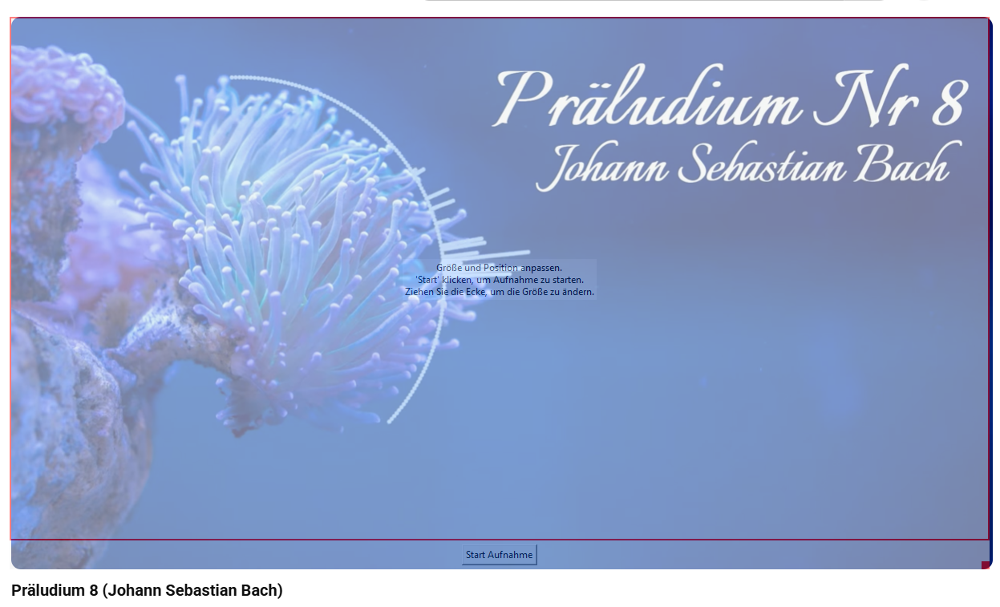

# 📼Screen Video Recorder with Audio Sync
Ein leistungsstarker Screen-Recorder, der in Python geschrieben wurde. Er ermöglicht es, einen spezifischen Bereich des Bildschirms auszuwählen und gleichzeitig das System-Audio (Loopback) synchron aufzunehmen.



## 💡 Features
Bereichsauswahl: Ein transparentes GUI-Fenster erlaubt das millimetergenaue Zuschneiden des Aufnahmebereichs.

Audio-Loopback: Nimmt den Sound direkt von deinen Lautsprechern auf (kein Mikrofon nötig).

Auto-Sync: Verwendet Zeitstempel und FFmpeg, um Video- und Audiodaten präzise zusammenzuführen.

Intelligente Benennung: Verhindert das Überschreiben alter Aufnahmen durch automatische Nummerierung (aufnahme_1.mp4, etc.).

## 🛠️ Voraussetzungen
### 1. System-Tools
Dieses Projekt benötigt FFmpeg für das Muxing von Video und Audio.

Windows: winget install ffmpeg oder von ffmpeg.org.

macOS: brew install ffmpeg.

Linux: sudo apt install ffmpeg.

### 2. Python-Bibliotheken
Installiere die benötigten Abhängigkeiten über pip:

Bash
pip install opencv-python mss numpy soundcard soundfile
Hinweis für Linux-Nutzer: Eventuell musst du zusätzlich python3-tk installieren, damit das Auswahlfenster erscheint.

## ⚙️ Installation & Nutzung
Repository klonen:

Bash
git clone https://github.com/nobleman82/VideoRecorder.git
cd PROJEKTNAME
Skript starten:

Bash
python VideoRecorder.py

Alternativ  python AudioRecorder.py (Nimmt einen wav auf) 

## ⚙️ Optionen:
- Der VideoRecorder bietet einstellungen für Dateinamen, Codec und Video Einstellungen können am Beginn des Scripts verändert werden.
- Der AudioRecorder alleine bietet aktuell nur wav. Sample Rate aufnahmedauer, Kanäle und Dateinamen können eingestellt werden. (achtung Datei wird überschrieben)

VideoRecorder.py:
```python
VIDEO_FILENAME = "aufnahme.avi"
AUDIO_FILENAME = "aufnahme.wav"
OUTPUT_FILENAME = "output.mp4" 
TIMESTAMP_FILENAME = "timestamps.json" # Neue Datei für Zeitstempel
FPS = 30 # Standard-Framerate für flüssige Bewegungen
FOURCC = cv2.VideoWriter_fourcc(*'mp4v') # Codec für Videoausgabe (wird für FFmpeg benötigt)
SAMPLERATE = 44100  # Abtastrate für Audio
CHANNELS = 2        # Kanäle (Stereo)
# ERHÖHT: Größere Blockgröße gibt dem Audiotreiber mehr Puffer, um Diskontinuitäten bei langen Aufnahmen zu vermeiden.
BLOCKSIZE_MS = 250  # Audio-Blockgröße in Millisekunden (optimiert von 100 auf 250) 
```

AudioRecorder.py
```python
# Konfiguration der Aufnahme
SAMPLERATE = 44100  # Standard-Abtastrate
DURATION_SECONDS = 10 # Aufnahmedauer in Sekunden
CHANNELS = 2        # Stereo-Aufnahme
FILENAME = "system_audio_aufnahme.wav"

```


## 📦 Aufnahme: 

Positioniere und skaliere das rote Auswahlfenster über dem Bereich, den du aufnehmen möchtest.

Klicke auf "Start Aufnahme".

Um die Aufnahme zu beenden, klicke im kleinen Steuerungsfenster auf "Stop Aufnahme".

Ergebnis: Das Skript führt Video und Audio automatisch zusammen und speichert die finale Datei als output.mp4 (oder output_1.mp4 usw.) im Projektordner.

## 🔌 Funktionsweise (Technischer Überblick)
Das Skript nutzt ein Multi-Threading-System:

Thread A (Video): Nutzt mss für schnelle Screenshots und speichert diese mit Zeitstempeln.

Thread B (Audio): Nutzt soundcard für den WASAPI-Loopback (unter Windows), um das System-Audio abzugreifen.

Post-Processing: Sobald die Aufnahme stoppt, berechnet das Skript die tatsächliche Framerate basierend auf den Zeitstempeln und nutzt subprocess, um FFmpeg für das finale Rendering aufzurufen.
## ☕ Support my Work

Wenn dir MarkupPro gefällt oder dir bei deiner Arbeit hilft, freue ich mich über deine Unterstützung:

- **PayPal:** [Spende via PayPal](https://www.paypal.me/nobleman82)
- **Buy me a coffee:** [Kaffee spendieren](https://buymeacoffee.com/nobleman82)
- **Website:** [nobleman82.github.io](https://nobleman82.github.io/)

---

## 📺 YouTube

Besuche mich auf meinem [YouTube Kanal](https://www.youtube.com/@mariotuerk5671) für Updates und weitere Projekte.
## Lizenz
Dieses Projekt ist unter der MIT-Lizenz lizenziert.

## Rechtlicher Hinweis / Disclaimer
Dieses Tool ist ausschließlich für Bildungszwecke und für die Erstellung von Inhalten gedacht, an denen der Nutzer die entsprechenden Rechte besitzt (z. B. eigene Tutorials, Dokumentation von Software-Bugs).

Der Autor übernimmt keine Haftung für den Missbrauch dieser Software zur Erstellung illegaler Kopien von urheberrechtlich geschütztem Material (wie z. B. Streaming-Diensten). Die Nutzer sind selbst dafür verantwortlich, die Urheberrechtsbestimmungen und Nutzungsbedingungen der jeweiligen Plattformen und Inhalte einzuhalten.